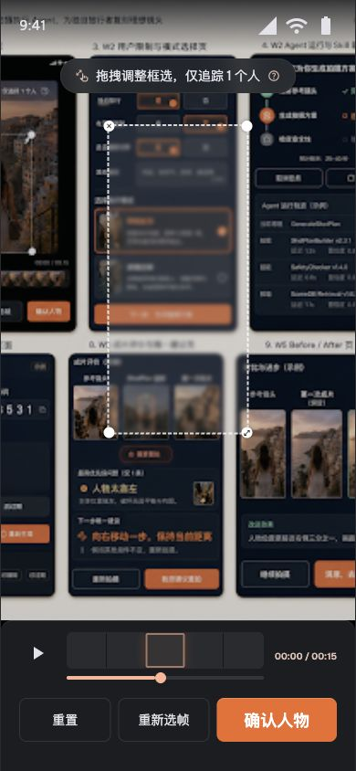
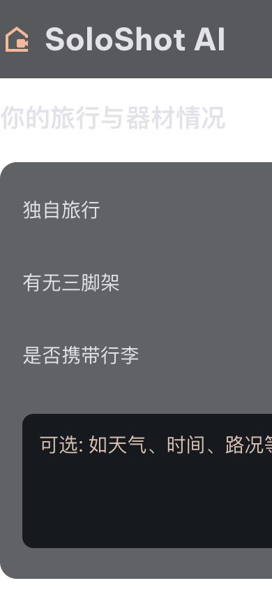
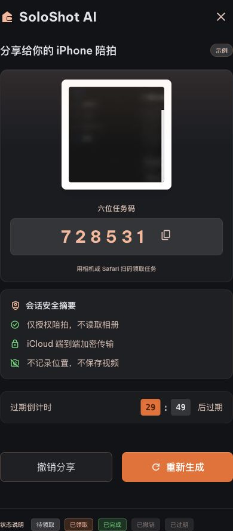
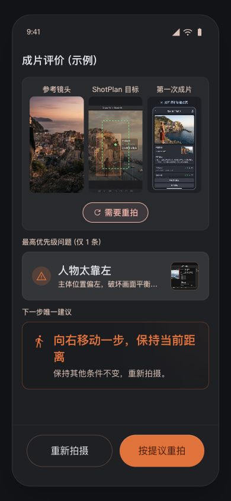
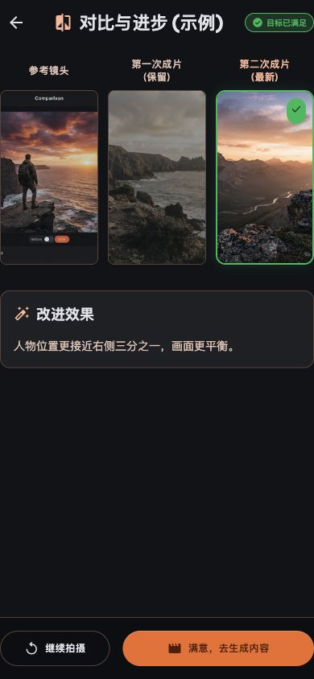
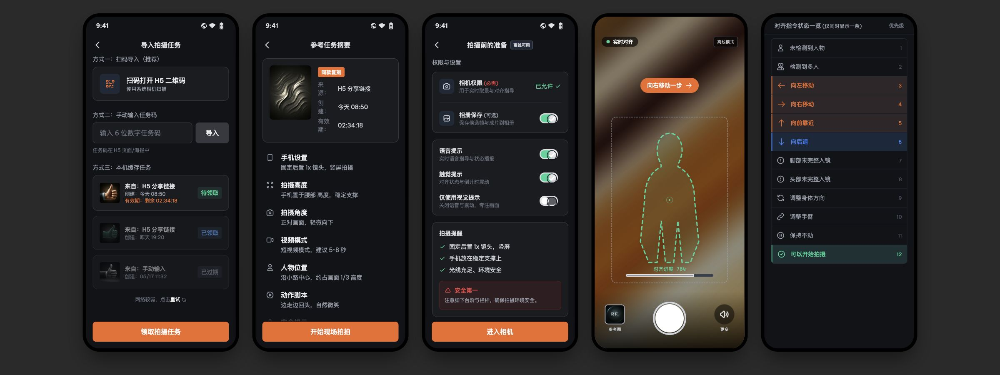
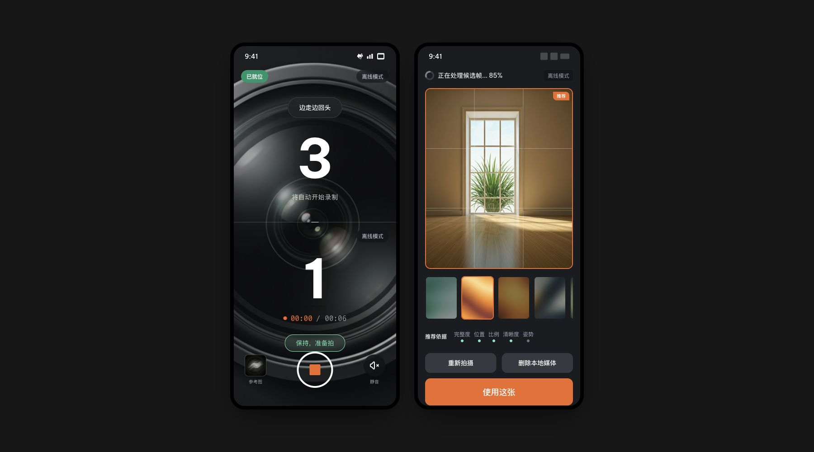

# Stitch UI 审核与后续实施边界

## 文档目的

本文固定 `stitch_ui_visual_replication/` 的使用边界和已知问题，防止 W2 及后续客户端工作把视觉探索稿误当成生产代码或产品事实来源。

当前项目仍按 W0 → W1 → W2 的工作包顺序推进。本文只是后续实施护栏，不代表 W2 已经开始，也不要求在 W1 阶段修复这些页面。

## 核心结论

`stitch_ui_visual_replication/` 可以保留为视觉方向、页面结构和信息层级参考，但不能作为可交付 P0 Demo、生产实现或逐像素验收基准。

发生冲突时，使用以下优先级：

1. `PRODUCT_OWNER_GUIDE.md`：产品范围、P0 路径和用户承诺。
2. `CODEX_IMPLEMENTATION_SPEC.md`：架构、工作包、恢复路径和完成标准。
3. `packages/contracts/`：跨端 DTO、枚举和状态的事实来源。
4. 已确认的 UI 总览图和设计 Token：视觉语言与品牌表现。
5. `stitch_ui_visual_replication/`：仅提供视觉和信息架构灵感。

不要仅凭旧 task 的聊天记录执行这些规则；根目录 `AGENTS.md` 已要求所有后续 UI 工作先阅读本文。

## 审核范围与方法

- 审核日期：2026-07-17。
- H5 关键页面使用 390×844 视口实际渲染并检查交互。
- iOS 视觉页面使用宽屏视口检查多屏结构和缺失状态。
- 审核对象是 Stitch 导出的 HTML、CSS、JavaScript 和其运行时素材，不是 `apps/h5` 或正式 iOS 客户端。
- 下列截图是当次浏览器实际渲染结果，已复制到仓库，避免依赖临时 task 目录。

## 关键渲染证据

### H5 内容入口

实际移动端首屏出现明显黑边，主 CTA 没有串到下一步。


### 暂停圈选

页面错误地把整张设计总览图当作参考素材；选择框只有按压变色，没有真实拖动和缩放。



### 限制与模式

颜色、间距和布局未按设计生效，模式卡也不能形成真实选择状态。



### Handoff

二维码显示为空白深色方块，无法扫码；复制、撤销和重新生成没有完整行为。



### 成片评价与 Before/After

评价素材混入其他 UI 截图，Before/After 也不是同一场景的两轮成片，无法证明第二次拍摄有所改善。





### iOS 页面

iOS 前五屏的信息结构有参考价值，但实际素材已被替换为无关图片。后半段文件名声称包含第 6–10 屏，实际只实现第 6、7 屏。





## 已知问题清单

| 页面或阶段 | 结论 | 已知问题 |
|---|---|---|
| H5 内容入口 | 不通过 | 上下黑边；主 CTA 不导航；远程首图不稳定 |
| 暂停圈选 | 不通过 | 背景素材错误；选择框不能拖动、缩放或重置 |
| 限制与模式 | 严重故障 | 普通 CSS 中使用无法解析的 Tailwind `theme()`；卡片无真实选择状态 |
| Agent 运行 | 条件通过 | 结构可参考；取消、失败重试和轨迹折叠未实现 |
| ShotPlan | 条件通过 | 信息层级可参考；参考图错误、内容过密、后续 CTA 无行为 |
| H5 拍摄/上传 | 不通过 | 使用设计总览图作为相机画面；拍摄、上传和取消均为静态外观 |
| Handoff | 严重故障 | 二维码不可扫描；复制、撤销、重新生成无效 |
| 成片评价 | 不通过 | 图片载入为其他 UI 截图，无法表达参考图与成片比较 |
| Before/After | 不通过 | 两轮素材场景不同，不能证明单问题修正和可见改善 |
| H5 内容生成 | 缺失 | 没有对应页面 |
| iOS 任务导入 | 条件通过 | 布局可参考；任务素材错误，导入和领取无行为 |
| iOS 任务摘要 | 条件通过 | 信息架构可参考；参考图是无关抽象纹理 |
| iOS 权限准备 | 条件通过 | 没有拒绝权限、重新授权和降级路径 |
| iOS 实时 Overlay | 不通过 | 没有真实参考场景或人物，无法验证轮廓可见性和坐标映射 |
| iOS 指令 Variants | 设计参考 | 适合作为规范页，不应作为正式用户流程页面 |
| 倒计时/录制 | 不通过 | 倒计时与录制状态同时显示，状态互斥关系错误 |
| 候选帧 | 不通过 | “处理中 85%”时仍允许删除和使用结果；素材不匹配 |
| iOS 成片评价 | 缺失 | 未实现 |
| iOS 第二轮复拍 | 缺失 | 未实现 |
| iOS 最终结果 | 缺失 | 未实现 |

## 跨页面 P0 风险

### 1. 没有真实可运行流程

页面是互相独立的静态 HTML，没有统一应用入口、路由、会话状态或刷新恢复。多个 CTA 只有外观，没有业务行为。

### 2. 素材和运行时依赖不可控

页面运行时依赖 Tailwind CDN、Google Fonts 和远程 Google 图片。部分图片地址已返回错误内容，离线、网络受限或远程资源变化时会直接破坏演示。

### 3. 样式与响应式实现不稳定

部分普通 CSS 使用 Tailwind `theme()`，浏览器无法解析；移动视口存在黑边、大块空白、布局丢失和内容溢出风险。

### 4. 关键交互是假交互

圈选、模式选择、相机、上传、二维码操作、取消、重试和下一步等关键动作没有完整状态转换或错误恢复。

### 5. 存在未经验证的产品声明

Handoff 页面声称使用“iCloud 端到端加密传输”，但当前仓库架构没有对应实现。任何安全、隐私、Douyin、iCloud、发布或平台能力声明都必须先有已验证实现。

### 6. 无障碍基础不足

多个中文页面声明 `lang="en"`，部分图标按钮没有可访问名称，模式卡没有单选语义，部分页面禁止用户缩放。正式实现必须使用 `lang="zh-CN"`、可访问名称、正确控件语义、可见焦点和至少 44×44 px 的主要点击区域。

## 可以保留的设计方向

- 深色背景、品牌橙主操作和成功绿状态。
- Agent、ShotPlan、Handoff 和 iOS 权限页的基础信息层级。
- “单条重拍建议”“离线模式”“演示数据/Mock”等诚实产品表达。
- 将复杂参数转换成用户可执行动作的文案方向。
- 页面结构和视觉节奏，但必须重新映射到真实产品状态和客户端架构。

## 禁止直接复用的内容

- 独立静态 HTML 作为正式路由或应用壳。
- Tailwind CDN、Google Fonts CDN 和不受控远程图片。
- 仅改变颜色但不改变真实状态的交互。
- 不可扫码二维码、虚假相机画面和跨场景 Before/After。
- 未经实现验证的安全、隐私、账号、发布或平台集成文案。
- 错误的语言声明、禁止缩放、无名称图标按钮和缺少语义的选择控件。
- 为了贴近 Stitch 而新增的非 P0 功能、字段或跨端能力。

## W2 开始前的实施要求

正式 H5 页面必须在 `apps/h5` 的现有 React/TypeScript 架构中实现，并满足以下要求：

- 使用生成的契约类型和现有 API，不从 Stitch 页面反推新的 DTO 或状态枚举。
- 完成一条最小但真实的纵向路径，再扩展其他页面。
- 使用真实路由、typed state、加载、取消、失败、重试和刷新恢复。
- 参考素材和图标进入受控本地资源或正式媒体服务，并保留来源归因。
- H5 相机只作为增强能力，文件上传始终是可靠后备。
- Mock 必须由显式配置开启，并在 UI、日志和 trace 中标记，不能冒充实时模型结果。
- 在 390×844 视口验证无横向溢出；主要点击区域不小于 44×44 px。
- 使用 `lang="zh-CN"`，允许用户缩放，并为图标按钮、选择控件和状态提示提供正确语义。
- 为关键路径添加组件测试和 Playwright；不能用截图存在代替交互通过。
- 若视觉稿与产品规格冲突，先服从产品规格；只有会改变范围、契约、隐私或外部服务的决策才询问用户。

建议 W2 的第一条纵向路径为：

```text
内容入口 → 暂停圈选 → 条件选择 → Agent 进度 → ShotPlan
```

完成标准至少包括：真实导航、可拖拽/缩放的圈选、模式状态、Agent 失败重试、ShotPlan 数据展示、刷新恢复和移动端无溢出。

## 后续 task 启动提示词

开始 W2 时可直接使用：

> 开始 W2 H5 公开体验。严格遵守 `AGENTS.md` 的 UI source hierarchy and Stitch boundary，并先阅读 `docs/STITCH_UI_AUDIT.md`。`stitch_ui_visual_replication/` 只作为视觉和页面结构参考，不要逐页照搬，也不要复用其静态假交互、远程素材、CDN 依赖或未经验证的产品声明。先在 `apps/h5` 中完成可运行、可恢复、经过移动端验证的最小 P0 纵向流程。

## 维护规则

- 若确认了新的 UI 总览图或设计 Token，在本文中更新“可以保留的设计方向”和验收要求。
- 若修复了某个已知问题，只在正式客户端验证通过后更新状态；不要因为 Stitch 静态页外观变化就标记完成。
- 若产品规格、契约或工作包范围变化，以对应事实来源为准，并同步更新本文和相关 ADR。
